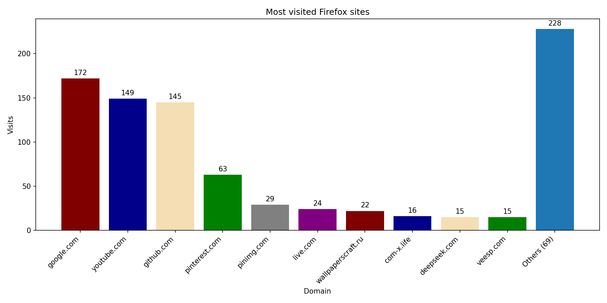

# History Script

Простой Python-проект, который читает историю Firefox и сохраняет самые посещаемые сайты в виде диаграммы.

## Что делает

- находит профиль Firefox в `~/.config/mozilla/firefox`
- копирует `places.sqlite` во временную директорию
- читает историю посещений из SQLite
- группирует посещения по доменам
- сохраняет диаграмму с самыми частыми сайтами через `matplotlib`

## Зависимости

- Python 3.10+
- `matplotlib`

Установка:

```bash
pip install matplotlib
```

## Запуск

```bash
python main.py
```

По умолчанию скрипт сохраняет топ-10 самых посещаемых доменов.

Результат сохраняется в файл `history.png` в директории проекта.

## Пример результата



## Следующие улучшения

- исключить служебные страницы Firefox вроде `about:`
